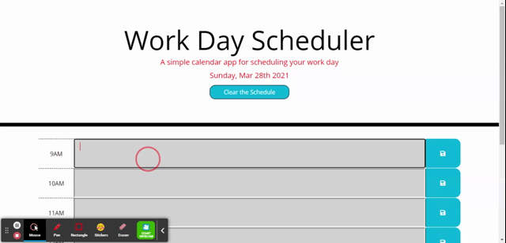

# Work Day Scheduler

It is a simple calendar application that allows the user to save events for each hour of the day. It also allows user to clear the schedule for that day too.

# Built with:
* HTML
* CSS
* JavaScript
* Bootstrap
* jQuery

# Screenshot of Project

# Link for Scheduler
https://aulakhhardeep.github.io/work-day-scheduler/

